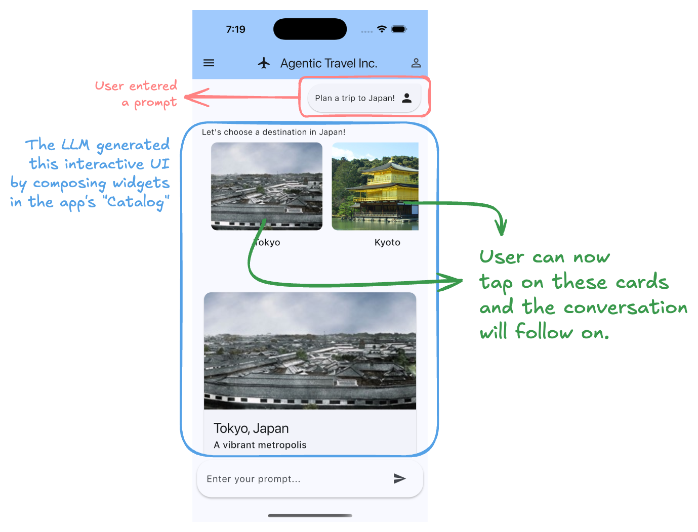

# Generative UI SDK for Flutter (flutter_genui)

A Flutter library to enable developers to easily add interactive
generative UI to their applications.

## Status: Highly Experimental

This is a highly experimental package, which means the API will change (sometimes drastically).
[Feedback is very welcome](https://github.com/flutter/genui/issues/new/choose).

## TL;DR

Our goal for the GenUI SDK for Flutter is to help you replace static "walls of text" from your LLM with
dynamic, interactive, graphical UI.
It uses a JSON-based format to compose UIs from your existing widget catalog, turning conversations or agent
interactions into rich, intuitive experiences. State changes in the UI update a client-side data model, which is fed back to the agent, creating a
powerful, high-bandwidth interaction loop. The GenUI SDK for Flutter aims to be easy to integrate into your Flutter
application to significantly improve the usability and satisfaction of your chatbots and next-generation
agent-based user experiences.

## High-level goals

- Increase Interaction Bandwidth for Users: allow users to interact with data and controls directly,
  making task completion faster and more intuitive. Move beyond a "wall of text".
- Simple and easy to use by developers: seamlessly integrate with your existing Flutter workflow,
  design systems, and widget catalogs.
- Drive agent-human UX forward: innovate ways to dramatically improve how users interact with their
  LLMs and Agents. Radically simplify the process of building UI-based agent interactions, by
  eliminating custom middleware between the agent and the UI layer.

## Use cases

- Incorporate graphical UI into chatbots: instead of describing a list of products in text,
  the LLM can render an interactive carousel of product widgets. Instead of asking for a user to
  type out answers to questions, the LLM can render sliders, checkboxes, and more.
- Create dynamically composed UIs: an agent can generate a complete form with sliders, date pickers,
  and text fields on the fly based on a user's request to "book a flight."

## Example

### Using the GenUI SDK with Firebase AI Logic

```dart
// Adding your widgets into the catalog.
// Start with the built-in catalog and add your own custom widgets.
final catalog = CoreCatalogItems.asCatalog().copyWith([
  myCustomNewWidget,
]);

/// Initializing the library.
final genUiManager = GenUiManager(catalog: catalog);
final aiClient = FirebaseAiClient(
  systemInstruction: '''
  You are a bicycle maintenance assistant who is an expert in diagnosing issues and
  giving step-by-step instructions.
  ''',
  tools: genUiManager.getTools(),
);
late final _uiAgent = UiAgent(
  genUiManager: genUiManager,
  aiClient: aiClient,
  onSurfaceAdded: _onSurfaceAdded,
  onSurfaceDeleted: (_) {},
  onTextResponse: (_) {},
  // ignore: avoid_print
  onWarning: (value) => print('Warning from UiAgent: $value'),
);

// Put the surface, added by AI, to the list of messages that should be rendered,
// trigger re-render, and scroll to bottom.
void _onSurfaceAdded(SurfaceAdded surface) {
  if (!mounted) return;
  setState(() {
    _messages.add(MessageController(surfaceId: surface.surfaceId));
  });
  _scrollToBottom();
}

// Render that UI.
Widget build(BuildContext context) {
   if (type == MessageType.genUi) {
     return GenUiSurface(
       host: _uiAgent.host,
       surfaceId: _surfaceId,
       onEvent: _handleEvent,
     );
   }
}
```

## Look & Feel

### Interactive [Travel App Example](examples/travel_app/)


_The GIF above shows how GenUI enables dynamic, interactive UI generation — instead of text descriptions or code from a traditional AI coding agent._

### Core Difference

This UI is not generated in the form of code; rather, it's generated at runtime based on a widget catalog from the developers' project.



## Implementation goals

- **Integrate with your LLM:** Work with your chosen LLM and backend to incorporate graphical
  UI responses alongside traditional text.
- **Leverage Your Widget Catalog:** Render UI using your existing, beautifully crafted widgets
  for brand and design consistency.
- **Interactive State Feedback:** Widget state changes are sent back to the LLM, enabling a
  true interactive loop where the UI influences the agent's next steps.
- **Framework Agnostic:** Be integrated into your agent library or LLM framework of choice.
- **JSON Based:** Use a simple, open standard for UI definition—no proprietary formats.
- **Cross-Platform Flutter:** Work anywhere Flutter works (mobile, iOS, Android, Web, and more).
- **Widget Composition:** Support nested layouts and composition of widgets for complex UIs.
- **Basic Layout:** LLM-driven basic layout generation.
- **Any Model:** Integrate with any LLM that can generate structured JSON output.

## Some things we're thinking about

- **Genkit Integration:** Integration with Genkit.
- **Expanded LLM Framework Support:** Official support for additional LLM frameworks.
- **Streaming UI:** Support for progressively rendering UI components as they stream from the LLM.
- **Full-Screen Composition:** Enable LLM-driven composition and navigation of entire app screens.
- **A2A Agent Support:** Support for A2A agent interactions.
- **Dart Bytecode:** Future support for Dart Bytecode for even greater dynamism and flexibility.

## Packages

| Package                                                          | Description                                                                   |
| ---------------------------------------------------------------- | ----------------------------------------------------------------------------- |
| [flutter_genui](packages/flutter_genui/)                         | (work in progress) A framework to employ Generative UI.                       |
| [flutter_genui_firebase_ai](packages/flutter_genui_firebase_ai/) | (work in progress) Firebase AI integration for flutter_genui.                 |
| [json_schema_builder](packages/json_schema_builder/)             | (work in progress) A fully featured Dart JSON Schema package with validation. |

## Usage

See [packages/flutter_genui/USAGE.md](packages/flutter_genui/USAGE.md).

## Contribute

See [CONTRIBUTING.md](CONTRIBUTING.md)
