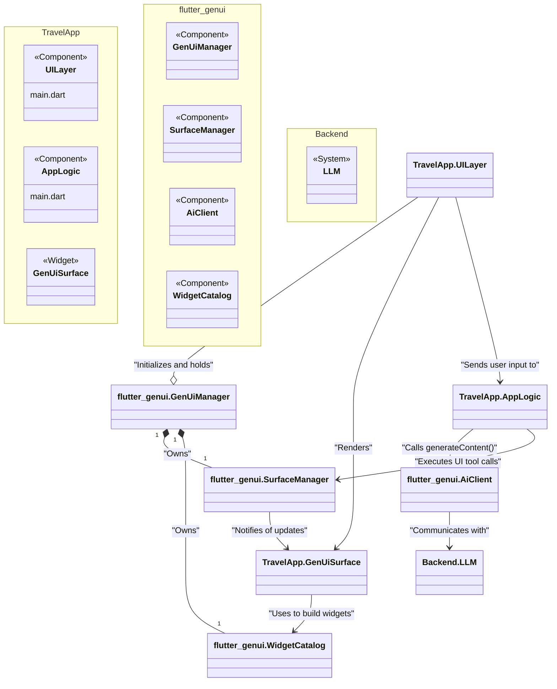
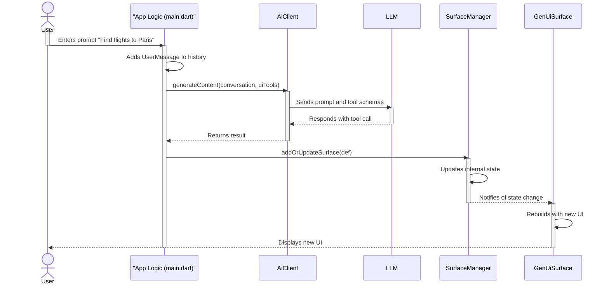
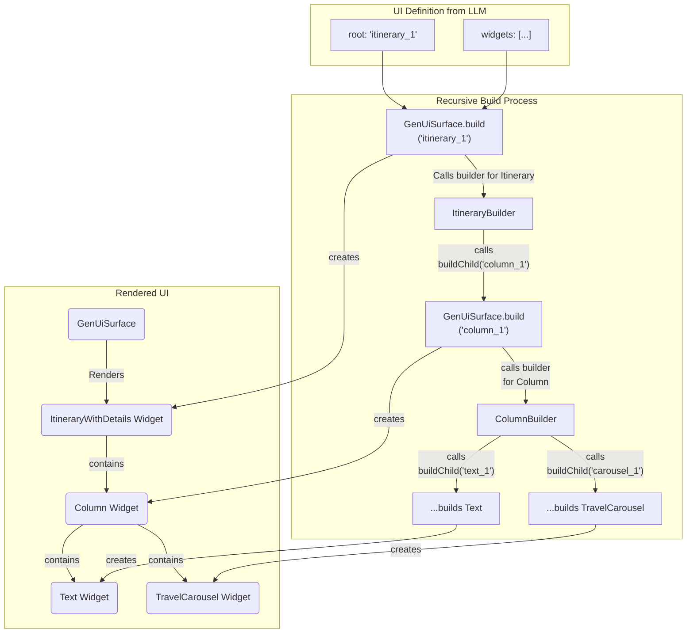

# Travel App Implementation

This document provides a comprehensive overview of the architecture, purpose, and implementation of the Travel App example.

## Purpose

The Travel App is a demonstration of a generative UI application built using the `flutter_genui` package. It functions as a conversational travel agent assistant. Instead of a static, predefined user interface, the app's UI is dynamically generated by a large language model (LLM) in response to the user's prompts. This allows for a highly flexible and context-aware user experience, where the UI adapts to the flow of the conversation.

## Architecture

The application is structured into several distinct layers, each with a specific responsibility. The following diagram illustrates the high-level architecture and the relationships between the main components.

### 1. UI Layer (`main.dart`)

This is the main entry point and the visible part of the application. Its responsibilities are:

- **Initialization**: It initializes Firebase, the `GenUiManager`, and the `AiClient`.
- **UI Scaffolding**: It provides the basic structure of the app, which consists of an app bar and a `GenUiChat` widget that renders the conversation and the dynamic UI surfaces.
- **State Management & App Logic**: It holds the core application logic. It manages the conversation history, sends prompts to the AI, and handles UI events returned from `GenUiSurface`.

### 2. UI State Management Layer ([`package:flutter_genui`](../../pkgs/flutter_genui/IMPLEMENTATION.md))

The components from the `flutter_genui` package are the central orchestrators of the dynamic UI state.

- **`GenUiManager`**: A container that owns the `SurfaceManager` and `Catalog`. Its main role is to provide the UI manipulation tools (`addOrUpdateSurface`, `deleteSurface`) to the app logic.
- **`SurfaceManager`**: The core state manager. It maintains the definitions for all active UI "surfaces" and notifies listening widgets (like `GenUiSurface`) when they change.
- **`GenUiChat`**: A facade widget that renders a complete chat experience, including a text input field and the conversation history. It automatically listens to the `SurfaceManager` and displays any generated UI surfaces.

### 3. AI/Model Layer (`package:flutter_genui`)

The `GeminiAiClient` class, also part of `flutter_genui`, abstracts the communication with the underlying generative AI model (a Google Gemini model via Firebase). It handles the API calls to the model, sending prompts and receiving the model's responses, including the tool calls that drive the UI generation.

### 4. Widget Catalog (The "Tools")

This is the collection of predefined UI components that the AI can use to construct the interface. It acts as the "API" that the AI targets.

- **Definition**: The catalog is defined in `lib/src/catalog.dart` as a `Catalog` instance, which is a list of `CatalogItem`s.
- **Custom Components**: The travel app defines several custom `CatalogItem`s in the `lib/src/catalog/` directory, such as `travel_carousel`, `itinerary_with_details`, and `filter_chip_group`.
- **Standard Components**: It also uses standard, pre-built components from `flutter_genui` like `column`, `text`, `elevatedButton`, etc.

## Data Flow: The Generative UI Cycle

The diagram below shows the sequence of events from user input to UI rendering. The application logic in `main.dart` is responsible for driving this cycle.

## Implementation Details

### The System Prompt

The interaction with the model is heavily guided by a detailed **system prompt** defined in `main.dart`. This prompt is critical to the application's success. It instructs the model on:

- **Persona**: To act as a helpful travel agent.
- **Conversation Flow**: To first ask clarifying questions and then present results.
- **Tool Usage**: Which widgets (tools) to use in different situations (e.g., use `travel_carousel` for options, `itinerary_with_details` for final results).
- **UI Style**: How to compose widgets for a good user experience (e.g., breaking up itineraries with other content).
- **Available Data**: It includes a JSON string (`_imagesJson`) containing a list of available asset image paths and descriptions, ensuring the model uses relevant and high-quality images from the application's assets.

### The Widget Catalog

The `catalog` is the cornerstone of the dynamic UI generation. It's a registry of all possible UI components the model can render.

Each component in the catalog is a `CatalogItem` with three key parts:

1. **`name`**: A unique string that the AI uses to identify the widget (e.g., `'travel_carousel'`).
2. **`dataSchema`**: A `Schema` object that defines the structure and types of data the widget expects. This schema is provided to the model so it knows what parameters to generate for the tool call. The descriptions within the schema are crucial for the model to understand the purpose of each parameter.
3. **`widgetBuilder`**: A Dart function that takes the data generated by the model (as a `Map<String, Object?>`) and returns a Flutter `Widget`.

### Catalog Item Definition

Each custom widget in `lib/src/catalog/` follows a consistent pattern:

1. **Schema Definition**: A `_schema` variable defines the data structure using `S.object`, `S.string`, `S.list`, etc.
2. **Data Accessor**: A Dart `extension type` is defined to provide type-safe access to the `Map<String, Object?>` data received from the model. This avoids manual casting and error-prone map access.
3. **`CatalogItem` Instance**: A final variable creates the `CatalogItem`, passing the `name`, `dataSchema`, and `widgetBuilder`.
4. **Widget Implementation**: A standard Flutter `StatelessWidget` or `StatefulWidget` that contains the actual UI code for the component.

### Dynamic UI Composition

Widgets can be nested to create complex layouts. This is achieved by having a widget's schema accept the ID of another widget as a parameter (e.g., the `child` property of `itinerary_with_details`).

The `widgetBuilder` for a container-like widget receives a `buildChild` function as an argument. It can call `buildChild(childId)` to recursively ask the `GenUiSurface` to build and return the child widget, which is then placed in the parent's widget tree.

### User Interaction and Events

The UI is not just for display; it's interactive. Widgets like `optionsFilterChip` and `filterChipGroup` can capture user input.

- **Event Dispatching**: The `widgetBuilder` receives a `dispatchEvent` function. This function is called in response to user actions (like a button press or item selection), creating a `UiEvent` (`UiActionEvent` for submissions, `UiChangeEvent` for value changes).
- **Event Handling**: The `onEvent` callback on the `GenUiChat` widget is triggered. The application logic in `main.dart` receives the event.
- **Conversation Update**: The app logic processes the event, wraps the information into `ToolResultPart`s inside a new `UserMessage`, adds it to the conversation history, and sends it to the model on the next turn. This informs the model of the user's actions, allowing it to respond accordingly (e.g., refining a search based on a selected filter).
