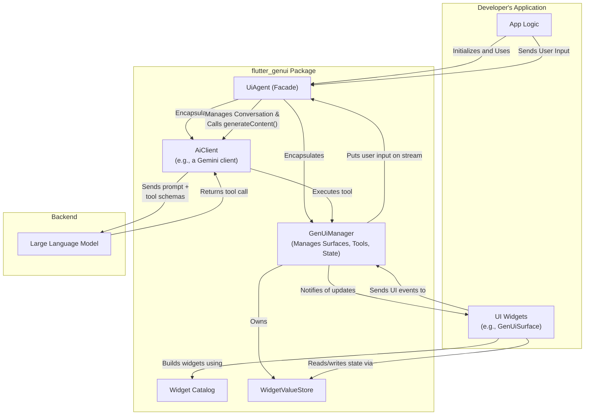
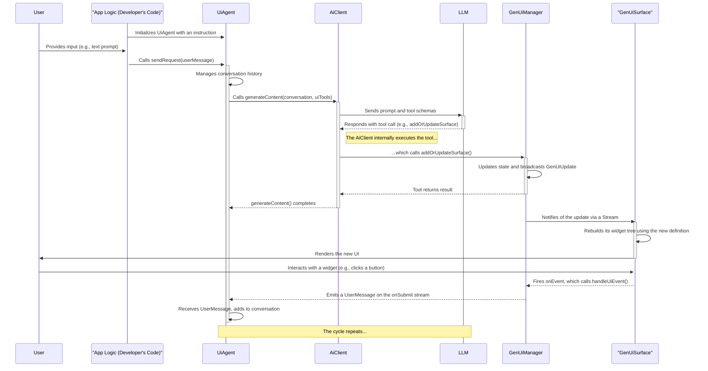

# `flutter_genui` Package Implementation

This document provides a comprehensive overview of the architecture, purpose, and implementation of the `flutter_genui` package.

## Purpose

The `flutter_genui` package provides the core framework for building Flutter applications with dynamically generated user interfaces powered by large language models (LLMs). It enables developers to create conversational UIs where the interface is not static or predefined, but is instead constructed by an AI in real-time based on the user's prompts and the flow of the conversation.

The package supplies the essential components for managing the state of the dynamic UI, interacting with the AI model, defining a vocabulary of UI widgets, and rendering the UI surfaces. The primary entry point for this package is the `UiAgent`.

## Architecture

The package is designed with a layered architecture, separating concerns to create a flexible and extensible framework. The diagram below shows how the `flutter_genui` package integrates with the developer's application and the backend LLM.

### 1. AI Client Layer (`lib/src/ai_client/`)

This layer is responsible for all communication with the generative AI model.

- **`AiClient`**: An abstract interface defining the contract for a client that interacts with an AI model. This allows for different LLM backends to be implemented.
- **Example Implementations**: The `flutter_genui_firebase_ai` package provides a concrete implementation that uses Google's Gemini models via Firebase. It handles the complexities of interacting with the Gemini API, including model configuration, retry logic, and tool management. It supports two main generation modes:
  - `generateContent`: For generating structured data that conforms to a specific schema. This is used for UI generation, where the AI is forced to call a specific tool that returns the UI definition.
  - `generateText`: For generating free-form text responses.
- **`AiTool`**: An abstract class for defining tools that the AI can invoke. These tools are the bridge between the AI and the application's capabilities. The `DynamicAiTool` provides a convenient way to create tools from simple functions.

### 2. UI State Management Layer (`lib/src/core/`)

This is the central nervous system of the package, orchestrating the state of all generated UI surfaces.

- **`GenUiManager`**: The core state manager for the dynamic UI. It maintains a map of all active UI "surfaces", where each surface is represented by a `UiDefinition`. It takes a `GenUiConfiguration` object that can restrict AI actions (e.g., only allow creating surfaces, not updating or deleting them). It provides the tools (`addOrUpdateSurface`, `deleteSurface`) that the AI uses to manipulate the UI. It exposes a stream of `GenUiUpdate` events (`SurfaceAdded`, `SurfaceUpdated`, `SurfaceRemoved`) so that the application can react to changes. It also owns the `WidgetValueStore` to manage the state of individual widgets (e.g., text field content) and acts as the `GenUiHost` for the `GenUiSurface` widget.
- **`ui_tools.dart`**: Contains the `AddOrUpdateSurfaceTool` and `DeleteSurfaceTool` classes that wrap the `GenUiManager`'s methods, making them available to the AI.

### 3. UI Model Layer (`lib/src/model/`)

This layer defines the data structures that represent the dynamic UI and the conversation.

- **`Catalog` and `CatalogItem`**: These classes define the registry of available UI components. The `Catalog` holds a list of `CatalogItem`s, and each `CatalogItem` defines a widget's name, its data schema, and a builder function to render it.
- **`UiDefinition` and `UiEvent`**: `UiDefinition` represents a complete UI tree to be rendered, including the root widget and a map of all widget definitions. `UiEvent` is a data object representing a user interaction. `UiActionEvent` is a subtype used for events that should trigger a submission to the AI, like a button tap.
- **`ChatMessage`**: A sealed class representing the different types of messages in a conversation: `UserMessage`, `AiTextMessage`, `ToolResponseMessage`, `AiUiMessage`, and `InternalMessage`.
- **`WidgetValueStore`**: A simple key-value store that holds the state of individual widgets on a per-surface basis (e.g., the current text in a `TextField`, the selected value of a `RadioGroup`). This allows state to be preserved during rebuilds and accessed when an action is triggered.

### 4. Widget Catalog Layer (`lib/src/catalog/`)

This layer provides a set of core, general-purpose UI widgets that can be used out-of-the-box.

- **`core_catalog.dart`**: Defines the `coreCatalog`, which includes fundamental widgets like `Column`, `Text`, `ElevatedButton`, `TextField`, `CheckboxGroup`, `RadioGroup`, and `Image`.
- **Widget Implementation**: Each core widget follows the standard `CatalogItem` pattern: a schema definition, a type-safe data accessor using an `extension type`, the `CatalogItem` instance, and the Flutter widget implementation.

### 5. UI Facade Layer (`lib/src/facade/`)

This layer provides high-level widgets and controllers for easily building a generative UI application.

- **`UiAgent`**: The primary entry point for the package. This facade class encapsulates the `GenUiManager` and `AiClient`, managing the conversation loop and orchestrating the entire generative UI process. The developer interacts with the `UiAgent` to send user messages and receive UI updates.
- **`GenUiSurface`**: The Flutter widget responsible for recursively building a UI tree from a `UiDefinition`. It listens for updates from a `GenUiHost` (typically the `GenUiManager`) for a specific `surfaceId` and rebuilds itself when the definition changes.

## How It Works: The Generative UI Cycle

The `UiAgent` simplifies the process of creating a generative UI by managing the conversation loop and the interaction with the AI.

1. **Initialization**: The developer creates a `UiAgent`, providing a system instruction. The `UiAgent` internally creates a `GenUiManager` and an `AiClient`.
2. **User Input**: The user enters a prompt.
3. **Send Request**: The developer calls `uiAgent.sendRequest(UserMessage.text(prompt))`.
4. **Conversation Management**: The `UiAgent` adds the `UserMessage` to its internal conversation history.
5. **AI Invocation**: The `UiAgent` calls `aiClient.generateContent()`, passing in the conversation history and the UI tools from the `GenUiManager`.
6. **Model Processing & Tool Call**: The LLM processes the conversation and returns a response indicating it wants to call a UI tool (e.g., `addOrUpdateSurface`).
7. **Tool Execution & State Update**: The `AiClient` receives the response, finds the corresponding `AiTool` object, and executes its `invoke` method. This calls the target function on the `GenUiManager` (e.g., `addOrUpdateSurface`).
8. **Notification**: The `GenUiManager` updates its internal state (the `UiDefinition` for the surface) and broadcasts a `GenUiUpdate` event on its `surfaceUpdates` stream.
9. **UI Rendering**: A `GenUiSurface` widget listening to the `GenUiManager` (via the `GenUiHost` interface) receives the update and rebuilds, rendering the new UI based on the updated `UiDefinition`.
10. **User Interaction**: The user interacts with the newly generated UI (e.g., clicks a submit button).
11. **Event Dispatch**: The `GenUiSurface`'s `onEvent` callback is fired, which in turn calls `host.handleUiEvent()`.
12. **Cycle Repeats**: The `GenUiManager`'s `handleUiEvent` method creates a `UserMessage` containing the state of the widgets on the surface (from its `WidgetValueStore`) and emits it on its `onSubmit` stream. The `UiAgent` is listening to this stream, receives the message, adds it to the conversation, and calls the AI again, thus continuing the cycle.
