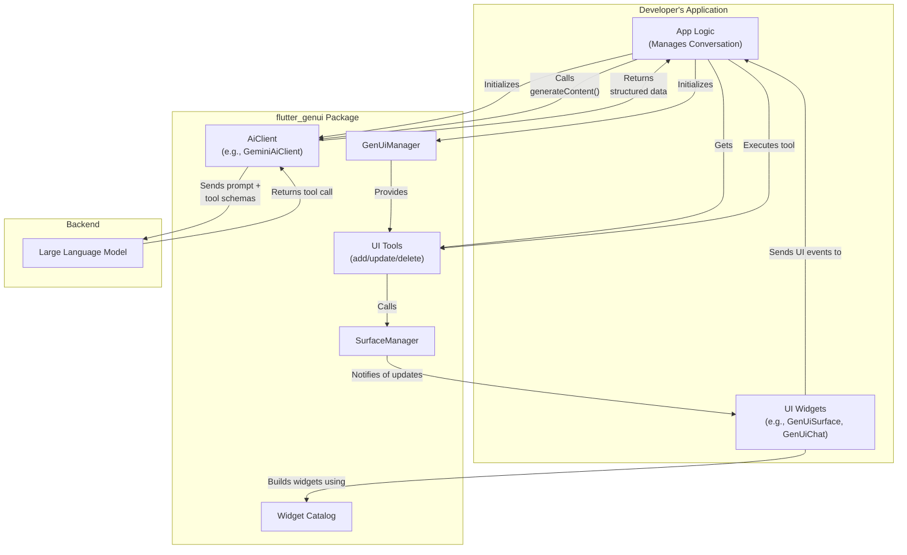
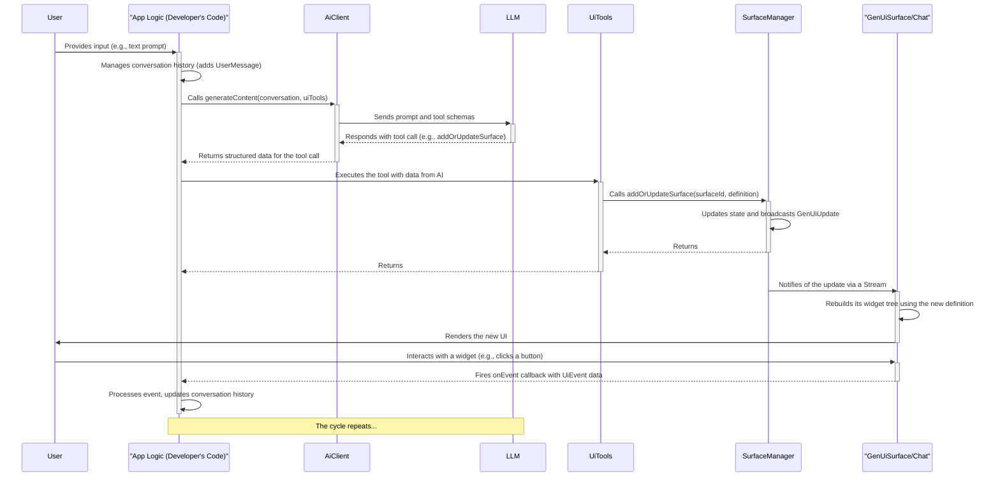

# `flutter_genui` Package Implementation

This document provides a comprehensive overview of the architecture, purpose, and implementation of the `flutter_genui` package.

## Purpose

The `flutter_genui` package provides the core framework for building Flutter applications with dynamically generated user interfaces powered by large language models (LLMs). It enables developers to create conversational UIs where the interface is not static or predefined, but is instead constructed by an AI in real-time based on the user's prompts and the flow of the conversation.

The package supplies the essential components for managing the state of the dynamic UI, interacting with the AI model, defining a vocabulary of UI widgets, and rendering the UI surfaces.

## Architecture

The package is designed with a layered architecture, separating concerns to create a flexible and extensible framework. The diagram below shows how the `flutter_genui` package integrates with the developer's application and the backend LLM.

### 1. AI Client Layer (`lib/src/ai_client/`)

This layer is responsible for all communication with the generative AI model.

- **`AiClient`**: An abstract interface defining the contract for a client that interacts with an AI model. This allows for different LLM backends to be implemented.
- **`GeminiAiClient`**: The default implementation of `AiClient`. It handles the complexities of interacting with the Gemini API, including model configuration, retry logic with exponential backoff, and tool management. It supports two main generation modes:
  - `generateContent`: For generating structured data that conforms to a specific schema. This is used for UI generation, where the AI is forced to call a specific tool that returns the UI definition.
  - `generateText`: For generating free-form text responses.
- **`AiTool`**: An abstract class for defining tools that the AI can invoke. These tools are the bridge between the AI and the application's capabilities. The `DynamicAiTool` provides a convenient way to create tools from simple functions.

### 2. UI State Management Layer (`lib/src/core/`)

This is the central nervous system of the package, orchestrating the state of all generated UI surfaces.

- **`SurfaceManager`**: The core state manager for the dynamic UI. It maintains a map of all active UI "surfaces", where each surface is represented by a `UiDefinition`. It provides the tools (`addOrUpdateSurface`, `deleteSurface`) that the AI uses to manipulate the UI. It exposes a stream of `GenUiUpdate` events (`SurfaceAdded`, `SurfaceUpdated`, `SurfaceRemoved`) so that the application can react to changes.
- **`GenUiManager`**: A high-level container that owns the `SurfaceManager` and the `Catalog`. Its primary role is to provide the set of UI manipulation `AiTool`s to the developer, which are then passed to the `AiClient`.
- **`ui_tools.dart`**: Contains the `AddOrUpdateSurfaceTool` and `DeleteSurfaceTool` classes that wrap the `SurfaceManager`'s methods, making them available to the AI.

### 3. UI Model Layer (`lib/src/model/`)

This layer defines the data structures that represent the dynamic UI and the conversation.

- **`Catalog` and `CatalogItem`**: These classes define the registry of available UI components. The `Catalog` holds a list of `CatalogItem`s, and each `CatalogItem` defines a widget's name, its data schema, and a builder function to render it.
- **`UiDefinition` and `UiEvent`**: `UiDefinition` represents a complete UI tree to be rendered, including the root widget and a map of all widget definitions. `UiEvent` is a data object representing a user interaction (e.g., a button tap), which is sent back from the UI to the application code.
- **`ChatMessage`**: A sealed class representing the different types of messages in a conversation: `UserMessage`, `AssistantMessage`, `ToolResponseMessage`, `UiResponseMessage`, and `InternalMessage`. The application developer is responsible for managing the list of these messages.
- **`UiEventManager`**: A utility to coalesce UI events. Change events (like text field changes) are collected and sent in a batch with the next action event (like a button tap). This prevents excessive calls to the AI model during rapid user input.

### 4. Widget Catalog Layer (`lib/src/catalog/`)

This layer provides a set of core, general-purpose UI widgets that can be used out-of-the-box.

- **`core_catalog.dart`**: Defines the `coreCatalog`, which includes fundamental widgets like `Column`, `Text`, `ElevatedButton`, `TextField`, `CheckboxGroup`, `RadioGroup`, and `Image`.
- **Widget Implementation**: Each core widget follows the standard `CatalogItem` pattern: a schema definition, a type-safe data accessor using an `extension type`, the `CatalogItem` instance, and the Flutter widget implementation.

### 5. UI Facade Layer (`lib/src/facade/`)

This layer provides high-level widgets for easily rendering the dynamic UI and conversation history.

- **`GenUiSurface`**: The Flutter widget responsible for recursively building a UI tree from a `UiDefinition`. It listens for updates from the `SurfaceManager` for a specific `surfaceId` and rebuilds itself when the definition changes.
- **`GenUiChat`**: A full-featured chat widget with a text input box. It uses a `GenUiChatController` to listen to the `SurfaceManager`'s updates and automatically displays new or updated `GenUiSurface` widgets as they are created by the AI.
- **`ConversationWidget`**: A more general-purpose widget that takes a `List<ChatMessage>` and renders it. It can display text messages from the user and assistant, as well as `UiResponseMessage`s, which it renders using `GenUiSurface`.

## How It Works: The Generative UI Cycle

The application developer is in control of the conversation loop. The `flutter_genui` package manages UI state, but not the conversation history. This separation of concerns allows for greater flexibility in how the conversation is managed. The following sequence diagram illustrates this process.

1. **Initialization**: The developer creates a `GenUiManager` and an `AiClient`. They get the UI manipulation tools by calling `manager.getTools()`.
2. **User Input**: The user enters a prompt or interacts with an existing UI element.
3. **Conversation Management**: The developer is responsible for maintaining a `List<ChatMessage>`. When the user provides input, the developer creates a `UserMessage` and adds it to the list.
4. **AI Invocation**: The developer calls `aiClient.generateContent()` or `aiClient.generateText()`, passing in the conversation history and the UI tools from `GenUiManager`.
5. **Model Processing & Tool Call**: The LLM processes the conversation. To manipulate the UI, it calls one of the provided tools (e.g., `addOrUpdateSurface`), passing a `surfaceId` and a `UiDefinition`.
6. **UI State Update**: The `AddOrUpdateSurfaceTool` calls the corresponding method on the `SurfaceManager`.
7. **Notification**: The `SurfaceManager` updates its internal state and broadcasts a `GenUiUpdate` event (e.g., `SurfaceAdded` or `SurfaceUpdated`) on its `updates` stream.
8. **UI Rendering**: A `GenUiSurface` widget (or a widget that uses it, like `GenUiChat`) listening for that `surfaceId` receives the update from the `SurfaceManager`.
9. **Dynamic UI Build**: The `GenUiSurface` rebuilds, using the new `UiDefinition` and the `Catalog` to render the Flutter widget tree.
10. **User Interaction**: The user interacts with the newly generated UI (e.g., clicks a button).
11. **Event Dispatch**: The widget's handler creates a `UiEvent` and sends it up to the `GenUiSurface`'s `onEvent` callback.
12. **Event Handling**: The developer's application code receives the `UiEvent` from the callback.
13. **Cycle Repeats**: The developer processes the `UiEvent`, creates a new `UserMessage` (often containing `ToolResultPart`s to represent the UI interaction), adds it to the conversation history, and calls the AI again, thus continuing the cycle.
