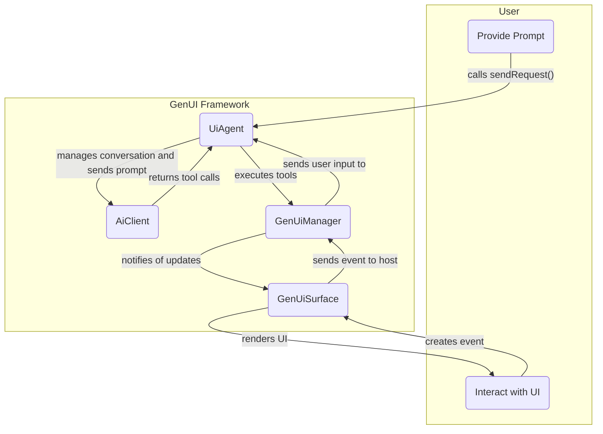

# flutter_genui

A Flutter package for building dynamic, conversational user interfaces powered by generative AI models.

`flutter_genui` allows you to create applications where the UI is not static or predefined, but is instead constructed by an AI in real-time based on a conversation with the user. This enables highly flexible, context-aware, and interactive user experiences.

This package provides the core functionality for GenUI. For a concrete implementation that uses Firebase AI, see the `flutter_genui_firebase_ai` package.

## Features

- **Dynamic UI Generation**: Render Flutter UIs from structured data returned by a generative AI.
- **Simplified Conversation Flow**: A high-level `UiAgent` facade manages the interaction loop with the AI.
- **Customizable Widget Catalog**: Define a "vocabulary" of Flutter widgets that the AI can use to build the interface.
- **Extensible AI Client**: Abstract interface for connecting to different AI model backends.
- **Event Handling**: Capture user interactions (button clicks, text input) and send them back to the AI as context for the next turn in the conversation.

## Core Concepts

The package is built around three main components:

1. **`UiAgent`**: The primary facade and entry point for the package. It encapsulates the `GenUiManager` and `AiClient`, manages the conversation history, and orchestrates the entire generative UI process.

2. **`Catalog`**: A collection of `CatalogItem`s that defines the set of widgets the AI is allowed to use. Each `CatalogItem` specifies a widget's name (for the AI to reference), a data schema for its properties, and a builder function to render the Flutter widget.

3. **`AiClient`**: An interface for communicating with a generative AI model. For a concrete implementation, see `FirebaseAiClient` in the `flutter_genui_firebase_ai` package.

## Getting Started

To use `flutter_genui`, you need to initialize a `UiAgent`, provide it with a system prompt, and render the UI surfaces it manages.

```dart
import 'package:flutter/material.dart';
import 'package:flutter_genui/flutter_genui.dart';
import 'package:flutter_genui_firebase_ai/flutter_genui_firebase_ai.dart';

void main() {
  // Initialize Firebase, etc.
  runApp(const MyApp());
}

class MyApp extends StatefulWidget {
  const MyApp({super.key});

  @override
  State<MyApp> createState() => _MyAppState();
}

class _MyAppState extends State<MyApp> {
  late final UiAgent _uiAgent;
  final List<GenUiUpdate> _updates = [];

  @override
  void initState() {
    super.initState();

    // 1. Create a UiAgent with a system instruction
    final genUiManager = GenUiManager(catalog: CoreCatalogItems.asCatalog());
    final aiClient = FirebaseAiClient(
      systemInstruction: 'You are a helpful AI assistant that builds UIs.',
      tools: genUiManager.getTools(),
    );
    _uiAgent = UiAgent(
      genUiManager: genUiManager,
      aiClient: aiClient,
      onSurfaceAdded: _onSurfaceAdded,
    );
  }

  void _onSurfaceAdded(SurfaceAdded update) {
    setState(() {
      _updates.add(update);
    });
  }

  void _sendPrompt(String text) {
    if (text.trim().isEmpty) return;
    _uiAgent.sendRequest(UserMessage.text(text));
  }

  @override
  void dispose() {
    _uiAgent.dispose();
    super.dispose();
  }

  @override
  Widget build(BuildContext context) {
    return MaterialApp(
      home: Scaffold(
        appBar: AppBar(title: const Text('GenUI Demo')),
        body: Column(
          children: [
            Expanded(
              // 2. Render the dynamic UI surfaces
              child: ListView.builder(
                itemCount: _updates.length,
                itemBuilder: (context, index) {
                  final update = _updates[index];
                  return GenUiSurface(
                    host: _uiAgent.host,
                    surfaceId: update.surfaceId,
                    onEvent: (event) {
                      // 3. The UiAgent handles events automatically
                    },
                  );
                },
              ),
            ),
            // Your chat input widget would go here, calling _sendPrompt
          ],
        ),
      ),
    );
  }
}
```

## How It Works

The `UiAgent` manages the interaction cycle:

1. **User Input**: The user provides a prompt (e.g., through a text field). The app calls `uiAgent.sendRequest()`.
2. **AI Invocation**: The `UiAgent` adds the user's message to its internal conversation history and sends it to the `AiClient`.
3. **AI Response**: The AI model processes the conversation and, guided by the schemas of the widgets in your `Catalog`, returns a structured response with instructions to `add`, `update`, or `delete` UI elements by calling the appropriate tools.
4. **UI State Update**: The `UiAgent` executes these tool calls, which updates the internal `GenUiManager`.
5. **UI Rendering**: The `GenUiManager` broadcasts an update, and any `GenUiSurface` widgets listening for that surface ID will rebuild to display the new UI.
6. **User Interaction**: The user interacts with the newly generated UI. The `GenUiSurface` captures these events and forwards them to the `UiAgent`'s `GenUiManager`, which automatically creates a new `UserMessage` and restarts the cycle.



See [IMPLEMENTATION.md](./IMPLEMENTATION.md) for more detailed information about the design.
