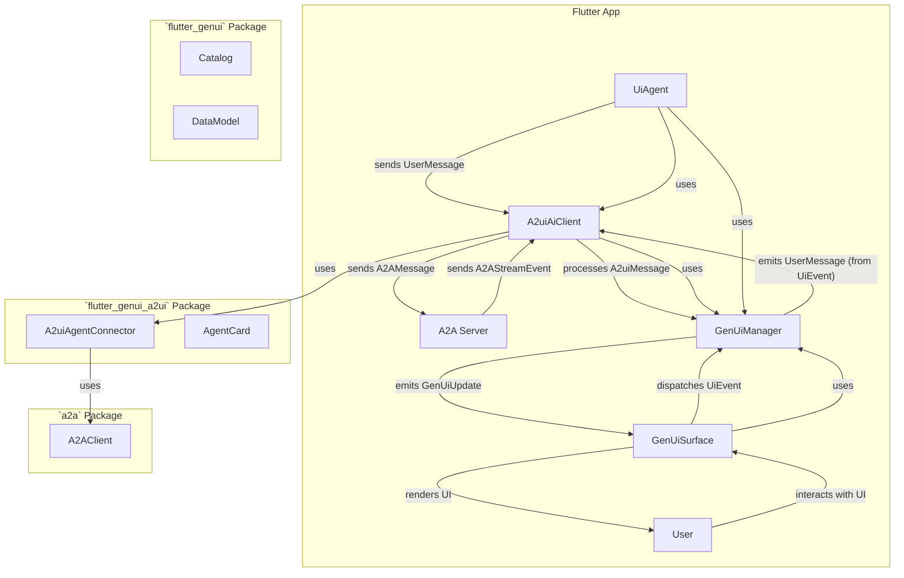

# Design Document: `flutter_genui_a2ui`

## Overview

This document outlines the design for the `flutter_genui_a2ui` package, a new addition to the `flutter_genui` family of packages. Its primary purpose is to enable Flutter applications to connect to an A2A (Agent-to-Agent) server, receive A2UI (Agent-to-UI) protocol messages, and render dynamic user interfaces using the core `flutter_genui` rendering capabilities. This package will provide a high-quality, first-class integration, including comprehensive tests and an example application.

## Detailed Analysis of the Goal or Problem

The existing `flutter_genui` package provides a robust framework for building generative UIs, including a `GenUiManager` for state management, a `Catalog` for widget definitions, and a `GenUiSurface` for rendering. It also defines `A2uiMessage` types (e.g., `SurfaceUpdate`, `DataModelUpdate`, `BeginRendering`, `SurfaceDeletion`) that align with the A2UI protocol.

The `a2ui_client` spike demonstrates a working client for the A2UI Streaming UI Protocol, handling communication with an A2A server and interpreting the incoming JSONL messages to build a UI. However, this spike uses its own `A2uiInterpreter` and `WidgetRegistry` for rendering, which duplicates functionality already present in `flutter_genui`.

The problem is to integrate the A2A communication and A2UI message parsing from the `a2ui_client` spike with the sophisticated UI rendering and state management of `flutter_genui`, creating a cohesive and high-quality package that leverages the strengths of both. The new package should not depend on Firebase.

## Alternatives Considered

1.  **Directly porting `a2ui_client`'s rendering logic into `flutter_genui_a2ui`:** This was immediately rejected as it would lead to code duplication and prevent leveraging the existing, more mature `flutter_genui` rendering pipeline. The core requirement is to _use_ `flutter_genui` for rendering, not to re-implement it.

2.  **Modifying `flutter_genui` directly to include A2A client capabilities:** This was considered but rejected. `flutter_genui` is designed to be a core, AI-agnostic UI generation framework. Adding A2A-specific client logic would couple it to a particular communication protocol, violating the principle of separation of concerns. A dedicated package is more appropriate for this integration.

3.  **Creating a thin wrapper around `flutter_genui` using code from the `a2ui_client` spike:** This is the chosen approach. It allows for clear separation of responsibilities, where `flutter_genui_a2ui` acts as the bridge, handling A2A communication and translating A2UI messages into a format consumable by `flutter_genui`'s `GenUiManager`.

## Detailed Design for the New Package

The `flutter_genui_a2ui` package will consist of the following key components:

### 1. `A2uiAiClient` (implements `AiClient` from `flutter_genui`)

This will be the central class for connecting the A2A server to the `flutter_genui`'s `UiAgent`. It will implement the `AiClient` interface, but instead of performing AI inference, it will manage the A2A connection and process incoming A2UI messages.

- **Dependencies:** `flutter_genui`, `a2a` (for A2A communication).
- **Constructor:**
  - `A2uiAiClient({required Uri serverUrl, required GenUiManager genUiManager})`
- **Internal State:**
  - `A2AClient _a2aClient`: An instance of the A2A client for communication.
  - `GenUiManager _genUiManager`: The `GenUiManager` instance provided by the `UiAgent`.
  - `StreamController<A2uiMessage> _a2uiMessageController`: A stream controller to process incoming A2UI messages from the A2A server.
  - `String? _taskId`, `String? _contextId`: To manage the A2A conversation context.
  - `ValueNotifier<int> _activeRequests`: To implement the `activeRequests` getter from `AiClient`.
- **Key Methods:**
  - `Future<AgentCard> getAgentCard()`: Fetches the agent card from the A2A server, similar to `A2uiAgentConnector.getAgentCard` in the spike.
  - `Future<void> sendUserMessage(String messageText, {void Function(String)? onResponse})`: Sends a user message to the A2A server. This will be called by the `UiAgent`.
  - `Future<T?> generateContent<T extends Object>(List<ChatMessage> conversation, Schema outputSchema, {Iterable<AiTool> additionalTools = const []})`: This method will be the entry point for `UiAgent` to send messages. It will extract the latest user message from the `conversation` and send it to the A2A server via `_a2aClient`. It will then listen to the `_a2uiMessageController` and pass the `A2uiMessage`s to `_genUiManager.handleMessage`. The `outputSchema` will be ignored as the UI is driven by the A2UI stream, not direct AI output.
  - `Future<String> generateText(List<ChatMessage> conversation, {Iterable<AiTool> additionalTools = const []})`: This method will also extract the latest user message and send it. It will return an empty string or a placeholder, as text responses are handled by `onResponse` in `sendUserMessage`.
  - `void _processA2aStream(Stream<A2AStreamEvent> events)`: An internal method to process the raw A2A stream events, extract A2UI messages, and add them to `_a2uiMessageController`.
  - `void _handleUiEvent(UiEvent event)`: This method will be registered with `_genUiManager.onSubmit` to capture user interactions from the rendered UI and send them back to the A2A server via `_a2aClient.sendMessage`.

### 2. Example Application

A comprehensive example application will be created within the `example/` directory of the new package. This application will demonstrate how to integrate `flutter_genui_a2ui` into a Flutter app.

- **Features:**
  - A chat conversation view to display user input and text responses from the A2A server.
  - A fixed UI surface (using `GenUiSurface`) that renders the A2UI-generated interface.
  - Input field for sending messages to the A2A agent.
  - Clear demonstration of how to initialize `A2uiAiClient` and `UiAgent`.
  - Basic error handling and loading indicators.

### 3. `A2uiAgentConnector` (Adapted from spike)

The core logic for connecting to the A2A server and handling the raw A2A stream will be **copied and adapted** from the `a2ui_client` spike's `A2uiAgentConnector`. **The spike will not be a direct dependency.** This class will be responsible for:

- Establishing and maintaining the WebSocket connection.
- Sending A2A messages (user input, UI events).
- Receiving A2A stream events.
- Parsing A2A stream events to extract A2UI protocol messages.

This adapted class will be internal to `flutter_genui_a2ui` and will be used by `A2uiAiClient`.

### 4. `AgentCard` (Adapted from spike)

The `AgentCard` class, representing metadata about the A2A agent, will also be **copied and adapted** from the spike and included in the new package.

## Diagrams

## Summary of the Design

The `flutter_genui_a2ui` package will act as a specialized `AiClient` for `flutter_genui`, enabling seamless integration with A2A servers. It will encapsulate the A2A communication logic, translate incoming A2UI messages into `flutter_genui`'s internal UI update mechanisms, and forward user interactions back to the A2A server. This design promotes modularity, reusability, and adherence to the existing `flutter_genui` architecture.

## References to Research URLs

No external web research was performed for this design, as all necessary information was derived from the provided local file content.
