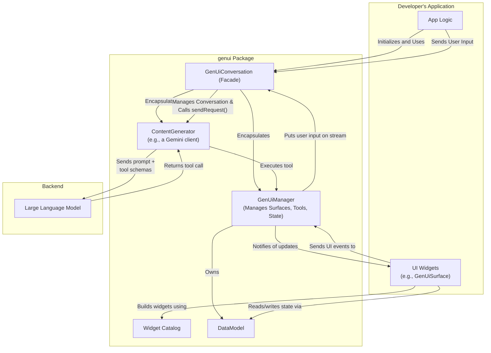
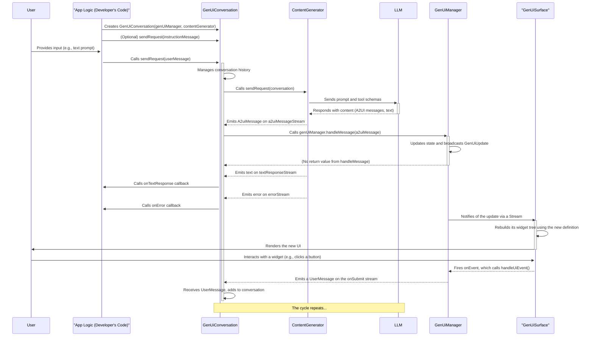

# `genui` Package Implementation

This document provides a comprehensive overview of the architecture, purpose, and implementation of the `genui` package.

## Purpose

The `genui` package provides the core framework for building Flutter applications with dynamically generated user interfaces powered by large language models (LLMs). It enables developers to create conversational UIs where the interface is not static or predefined, but is instead constructed by an AI in real-time based on the user's prompts and the flow of the conversation.

The package supplies the essential components for managing the state of the dynamic UI, interacting with the AI model, defining a vocabulary of UI widgets, and rendering the UI surfaces. The primary entry point for this package is the `GenUiConversation`.

## Architecture

The package is designed with a layered architecture, separating concerns to create a flexible and extensible framework. The diagram below shows how the `genui` package integrates with the developer's application and the backend LLM.

### 1. Content Generator Layer (`lib/src/content_generator.dart`)

This layer is responsible for all communication with the generative AI model.

- **`ContentGenerator`**: An abstract interface defining the contract for a client that interacts with an AI model. This allows for different LLM backends to be implemented. It exposes the following streams:
  - `a2uiMessageStream`: Emits `A2uiMessage` objects representing AI commands to modify text responses from the AI.
  - `errorStream`: Emits `ContentGeneratorError` objects when issues occur during AI interaction.
- **Example Implementations**: The `genui_firebase_ai` package provides a concrete implementation that uses Google's Gemini models via Firebase. It handles the complexities of interacting with the Gemini API, including model configuration, retry logic, and tool management.
- **`AiTool`**: An abstract class for defining tools that the AI can invoke. These tools are the bridge between the AI and the application's capabilities. The `DynamicAiTool` provides a convenient way to create tools from simple functions.

### 2. UI State Management Layer (`lib/src/core/`)

This is the central nervous system of the package, orchestrating the state of all generated UI surfaces.

- **`GenUiManager`**: The core state manager for the dynamic UI. It maintains a map of all active UI "surfaces", where each surface is represented by a `UiDefinition`. It takes a `GenUiConfiguration` object that can restrict AI actions (e.g., only allow creating surfaces, not updating or deleting them). The AI interacts with the manager by invoking tools defined in `ui_tools.dart` (`SurfaceUpdateTool`, `DeleteSurfaceTool`, `BeginRenderingTool`), which in turn call `genUiManager.handleMessage()`. It exposes a stream of `GenUiUpdate` events (`SurfaceAdded`, `SurfaceUpdated`, `SurfaceRemoved`) so that the application can react to changes. It also owns the `DataModel` to manage the state of individual widgets (e.g., text field content) and acts as the `GenUiHost` for the `GenUiSurface` widget.
- **`ui_tools.dart`**: Contains the `SurfaceUpdateTool` and `DeleteSurfaceTool` classes that wrap the `GenUiManager`'s methods, making them available to the AI.

### 3. UI Model Layer (`lib/src/model/`)

This layer defines the data structures that represent the dynamic UI and the conversation.

- **`Catalog` and `CatalogItem`**: These classes define the registry of available UI components. The `Catalog` holds a list of `CatalogItem`s, and each `CatalogItem` defines a widget's name, its data schema, and a builder function to render it.
- **`A2uiMessage`**: A sealed class (`lib/src/model/a2ui_message.dart`) representing the commands the AI sends to the UI. It has the following subtypes:
  - `BeginRendering`: Signals the start of rendering for a surface, specifying the root component.
  - `SurfaceUpdate`: Adds or updates components on a surface.
  - `DataModelUpdate`: Modifies data within the `DataModel` for a surface.
  - `SurfaceDeletion`: Requests the removal of a surface.
    The schemas for these messages are defined in `lib/src/model/a2ui_schemas.dart`.
- **`UiDefinition` and `UiEvent`**: `UiDefinition` represents a complete UI tree to be rendered, including the root widget and a map of all widget definitions. `UiEvent` is a data object representing a user interaction. `UserActionEvent` is a subtype used for events that should trigger a submission to the AI, like a button tap.
- **`ChatMessage`**: A sealed class representing the different types of messages in a conversation: `UserMessage`, `AiTextMessage`, `ToolResponseMessage`, `AiUiMessage`, `InternalMessage`, and `UserUiInteractionMessage`.
- **`DataModel` and `DataContext`**: The `DataModel` is a centralized, observable key-value store that holds the entire dynamic state of the UI. Widgets receive a `DataContext`, which is a view into the `DataModel` that understands the widget's current scope. This allows widgets to subscribe to changes in the data model and rebuild reactively. This separation of data and UI structure is a core principle of the architecture.

### 4. Widget Catalog Layer (`lib/src/catalog/`)

This layer provides a set of core, general-purpose UI widgets that can be used out-of-the-box.

- **`core_catalog.dart`**: Defines the `CoreCatalogItems`, which includes fundamental widgets like `AudioPlayer`, `Button`, `Card`, `CheckBox`, `Column`, `DateTimeInput`, `Divider`, `Icon`, `Image`, `List`, `Modal`, `MultipleChoice`, `Row`, `Slider`, `Tabs`, `Text`, `TextField`, and `Video`.
- **Widget Implementation**: Each core widget follows the standard `CatalogItem` pattern: a schema definition, a type-safe data accessor using an `extension type`, the `CatalogItem` instance, and the Flutter widget implementation.

### 5. UI Facade Layer (`lib/src/conversation/`)

This layer provides high-level widgets and controllers for easily building a generative UI application.

- **`GenUiConversation`**: The primary entry point for the package. This facade class encapsulates the `GenUiManager` and `ContentGenerator`, managing the conversation loop and orchestrating the entire generative UI process. It listens to the streams from the `ContentGenerator` and routes messages accordingly (e.g., `A2uiMessage` to `GenUiManager`, text to `onTextResponse` callback).
- **`GenUiSurface`**: The Flutter widget responsible for recursively building a UI tree from a `UiDefinition`. It listens for updates from a `GenUiHost` (typically the `GenUiManager`) for a specific `surfaceId` and rebuilds itself when the definition changes.

### 6. Primitives Layer (`lib/src/primitives/`)

This layer contains basic utilities used throughout the package.

- **`logging.dart`**: Provides a configurable logger (`genUiLogger`).
- **`simple_items.dart`**: Defines a type alias for `JsonMap`.

### 7. Direct Call Integration (`lib/src/facade/direct_call_integration/`)

This directory provides utilities for a more direct interaction with the AI model, potentially bypassing some of the higher-level abstractions of `GenUiConversation`. It includes:

- **`model.dart`**: Defines data models for direct API calls.
- **`utils.dart`**: Contains utility functions to assist with direct calls.

## How It Works: The Generative UI Cycle

The `GenUiConversation` simplifies the process of creating a generative UI by managing the conversation loop and the interaction with the AI.

1. **Initialization**: The developer creates a `GenUiConversation`, providing it with a `GenUiManager` and a `ContentGenerator`. The developer may also provide a system instruction to the `GenUiConversation` by sending an an initial `UserMessage`.
2. **User Input**: The user enters a prompt.
3. **Send Request**: The developer calls `genUiConversation.sendRequest(UserMessage.text(prompt))`.
4. **Conversation Management**: The `GenUiConversation` adds the `UserMessage` to its internal conversation history.
5. **AI Invocation**: The `GenUiConversation` calls `contentGenerator.sendRequest()`, passing in the conversation history.
6. **Model Processing & Response**: The LLM processes the conversation and the `ContentGenerator` emits responses on its streams.
7. **A2UI Message Handling**: When an `A2uiMessage` is received on the `a2uiMessageStream`, `GenUiConversation` calls `genUiManager.handleMessage()` with the message (e.g., `SurfaceUpdate`, `BeginRendering`).
8. **State Update & Notification**: The `GenUiManager` updates its internal state (the `UiDefinition` for the surface) based on the `A2uiMessage` and broadcasts a `GenUiUpdate` event on its `surfaceUpdates` stream.
9. **Text/Error Handling**: Text responses or errors from the `ContentGenerator`'s other streams trigger the `onTextResponse` or `onError` callbacks, respectively.
10. **UI Rendering**: A `GenUiSurface` widget listening to the `GenUiManager` (via the `GenUiHost` interface) receives the update and rebuilds, rendering the new UI based on the updated `UiDefinition`.
11. **User Interaction**: The user interacts with the newly generated UI (e.g., clicks a submit button).
12. **Event Dispatch**: The widget's builder calls a `dispatchEvent` function, which causes the `GenUiSurface` to call `host.handleUiEvent()`.
13. **Cycle Repeats**: The `GenUiManager`'s `handleUiEvent` method creates a `UserMessage` containing the state of the widgets on the surface (from its `DataModel`) and emits it on its `onSubmit` stream. The `GenUiConversation` is listening to this stream, receives the message, adds it to the conversation, and calls the AI again, thus continuing the cycle.
