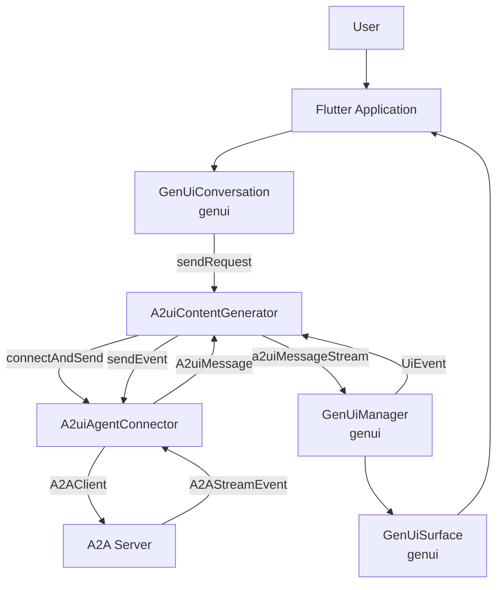

# Design Document: `genui_a2ui`

## Overview

This document outlines the design for the `genui_a2ui` package, an integration layer connecting the `genui` framework with servers implementing the [A2UI Streaming UI Protocol](https://a2ui.org). Its primary purpose is to enable Flutter applications to dynamically render UIs and handle interactions based on messages received from an A2A (Agent-to-Agent) server.

## Goal

To provide a seamless and robust way for Flutter applications using `genui` to consume A2UI streams, leveraging `genui`'s existing capabilities for UI rendering and state management, without tightly coupling the core `genui` package to the A2A protocol specifics.

## Core Components & Design

The architecture of `genui_a2ui` revolves around two main classes:

1.  **`A2uiContentGenerator`**: This class implements the `ContentGenerator` interface from `genui`. It serves as the primary bridge between `GenUiConversation` (the application's interface to the generative UI system) and the A2A server. Instead of generating content locally or calling a direct model API, it delegates communication to the `A2uiAgentConnector`.
    -   Manages the connection lifecycle.
    -   Exposes a `Stream<A2uiMessage>` (`a2uiMessageStream`) which `GenUiManager` consumes to update the UI.
    -   Exposes a `Stream<String>` (`textResponseStream`) for any text-based agent responses.
    -   Exposes a `Stream<ContentGeneratorError>` (`errorStream`) for handling communication errors.
    -   Implements `sendRequest` to send user messages/actions to the A2A server.

2.  **`A2uiAgentConnector`**: This class encapsulates the low-level details of the A2A protocol, using the `package:a2a` client library.
    -   Handles WebSocket connection management.
    -   Constructs and sends A2A messages (including user input and UI events).
    -   Receives `A2AStreamEvent`s from the server.
    -   Parses `A2ADataPart`s within the events to extract JSON-encoded A2UI messages.
    -   Converts the JSON A2UI messages into type-safe `A2uiMessage` objects defined in `genui`.
    -   Manages conversation state like `taskId` and `contextId` as provided by the A2A server.
    -   Streams the parsed `A2uiMessage` objects to the `A2uiContentGenerator`.

### Data Flow

1.  User input is sent via `GenUiConversation.sendRequest`.
2.  `A2uiContentGenerator` delegates to `A2uiAgentConnector` to send the message to the A2A Server.
3.  The server streams back `A2AStreamEvent`s containing A2UI messages.
4.  `A2uiAgentConnector` parses these into `A2uiMessage` objects.
5.  `A2uiContentGenerator` forwards these messages to `GenUiManager` via the `a2uiMessageStream`.
6.  `GenUiManager` updates the state, causing `GenUiSurface` to re-render.
7.  User interactions on `GenUiSurface` generate `UiEvent`s, which are sent back to the server via `A2uiContentGenerator` and `A2uiAgentConnector`'s `sendEvent` method.

### Alternatives Considered

-   **Embedding A2A logic directly in `genui`**: Rejected to keep the core framework decoupled from specific communication protocols.
-   **Re-implementing rendering logic**: Rejected in favor of leveraging `genui`'s established `GenUiManager` and `GenUiSurface` for UI rendering and state management.

The chosen approach of a separate integration package (`genui_a2ui`) provides the best separation of concerns.

## Summary

`genui_a2ui` acts as a specialized `ContentGenerator` for `genui`. It uses `A2uiAgentConnector` to interact with an A2A server, receives A2UI messages, and feeds them into the `GenUiManager` to dynamically drive the Flutter UI. This design ensures modularity and reusability.
