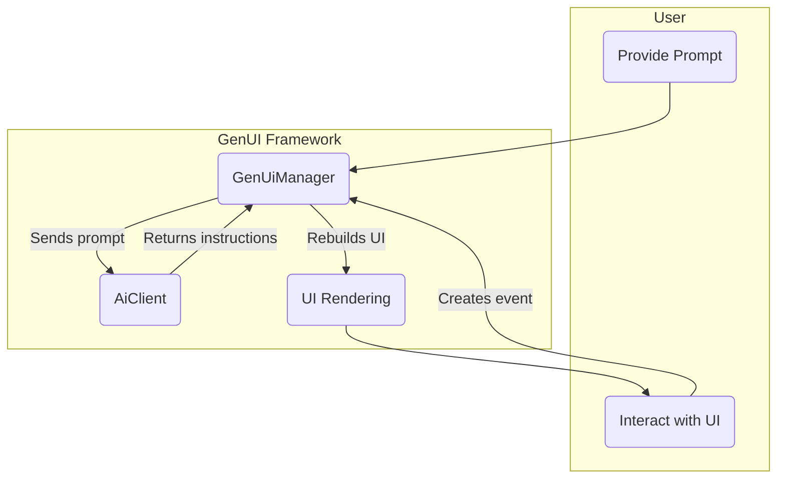

# flutter_genui

A Flutter package for building dynamic, conversational user interfaces powered by generative AI models.

`flutter_genui` allows you to create applications where the UI is not static or predefined, but is instead constructed by an AI in real-time based on a conversation with the user. This enables highly flexible, context-aware, and interactive user experiences.

## Features

- **Dynamic UI Generation**: Render Flutter UIs from structured data returned by a generative AI.
- **Conversational Flow**: Manage a back-and-forth conversation between the user and the AI, where the AI's responses are UI elements.
- **Customizable Widget Catalog**: Define a "vocabulary" of Flutter widgets that the AI can use to build the interface.
- **Extensible AI Client**: Abstract interface for connecting to different AI model backends. A ready-to-use `GeminiAiClient` for Firebase is included.
- **Event Handling**: Capture user interactions (button clicks, text input) and send them back to the AI as context for the next turn in the conversation.
- **Flexible UI Styles**: Supports both a free-form "flexible" layout and a traditional "chat" style interface.

## Core Concepts

The package is built around three main components:

1. **`GenUiManager`**: The central orchestrator. It manages the conversation history, communicates with the AI client, processes the AI's UI-building instructions, and renders the resulting widgets.

2. **`Catalog`**: A collection of `CatalogItem`s that defines the set of widgets the AI is allowed to use. Each `CatalogItem` specifies a widget's name (for the AI to reference), a data schema for its properties, and a builder function to render the Flutter widget.

3. **`AiClient`**: An interface for communicating with a generative AI model. The package includes `GeminiAiClient` for interacting with Gemini models via the Firebase AI SDK.

## Getting Started

To use `flutter_genui`, you need to set up an `AiClient`, define a `Catalog` of widgets, and initialize the `GenUiManager`.

```dart
import 'package:flutter/material.dart';
import 'package:flutter_genui/flutter_genui.dart';

void main() {
  // Initialize Firebase, etc.
  runApp(const MyApp());
}

class MyApp extends StatefulWidget {
  const MyApp({super.key});

  @override
  State<MyApp> createState() => _MyAppState();
}

class _MyAppState extends State<MyApp> {
  late final GenUiManager _genUiManager;
  late final AiClient _aiClient;

  @override
  void initState() {
    super.initState();

    // 1. Create an AI Client
    _aiClient = GeminiAiClient(
      systemInstruction: 'You are a helpful AI assistant that builds UIs.',
    );

    // 2. Define a Catalog of widgets the AI can use
    final myCatalog = Catalog([
      // Use pre-built core widgets
      columnCatalogItem,
      text,
      elevatedButtonCatalogItem,
      // ... add your own custom CatalogItems
    ]);

    // 3. Initialize the manager
    _genUiManager = GenUiManager.chat(
      aiClient: _aiClient,
      catalog: myCatalog,
    );
  }

  @override
  void dispose() {
    _genUiManager.dispose();
    super.dispose();
  }

  @override
  Widget build(BuildContext context) {
    return MaterialApp(
      home: Scaffold(
        appBar: AppBar(title: const Text('GenUI Demo')),
        // 4. Render the dynamic UI
        body: _genUiManager.widget(),
      ),
    );
  }
}
```

## How It Works

The interaction follows a cycle:

1. **User Input**: The user provides a prompt (e.g., through a text field in the `GenUiChat` widget).
2. **AI Invocation**: `GenUiManager` sends the conversation history (including the new prompt) to the `AiClient`.
3. **AI Response**: The AI model processes the conversation and, guided by the schemas of the widgets in your `Catalog`, returns a structured response with instructions to `add`, `update`, or `delete` UI elements.
4. **UI Rendering**: `GenUiManager` processes these instructions and rebuilds the UI using the appropriate widget builders from the `Catalog`.
5. **User Interaction**: The user interacts with the newly generated UI. These interactions are captured as events.
6. **Event Handling**: The events are sent back to the `GenUiManager`, added to the conversation history, and sent to the AI on the next turn, continuing the cycle.

